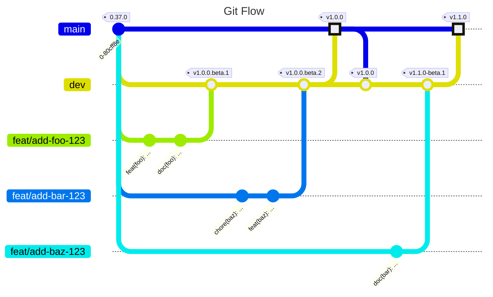

## Release Workfow

```mermaid
---
title: Git Flow
---

gitGraph
   commit tag: "0.37.0"
   branch dev
   checkout dev
   branch "feat/add-foo-123"
   checkout "feat/add-foo-123"
   commit id: "feat(foo): ..."
   commit id: "doc(foo): ..."
    checkout dev
    branch "feat/add-bar-123"
   checkout dev
   branch "feat/add-baz-123"
    checkout dev
    merge "feat/add-foo-123" tag: "v1.0.0.beta.1"
    checkout feat/add-bar-123
   commit id: "chore(baz): ..."
   commit id: "feat(baz): ..."
   checkout dev
   merge feat/add-bar-123 tag: "v1.0.0.beta.2"
   checkout main
   merge dev type: HIGHLIGHT tag: "v1.0.0"
   checkout dev
   merge main tag: "v1.0.0"
   checkout "feat/add-baz-123"
   commit id: "doc(bar): ..."
   checkout dev
   merge "feat/add-baz-123" tag: "v1.1.0-beta.1"
   checkout main
   merge dev type: HIGHLIGHT tag: "v1.1.0"
   
```
