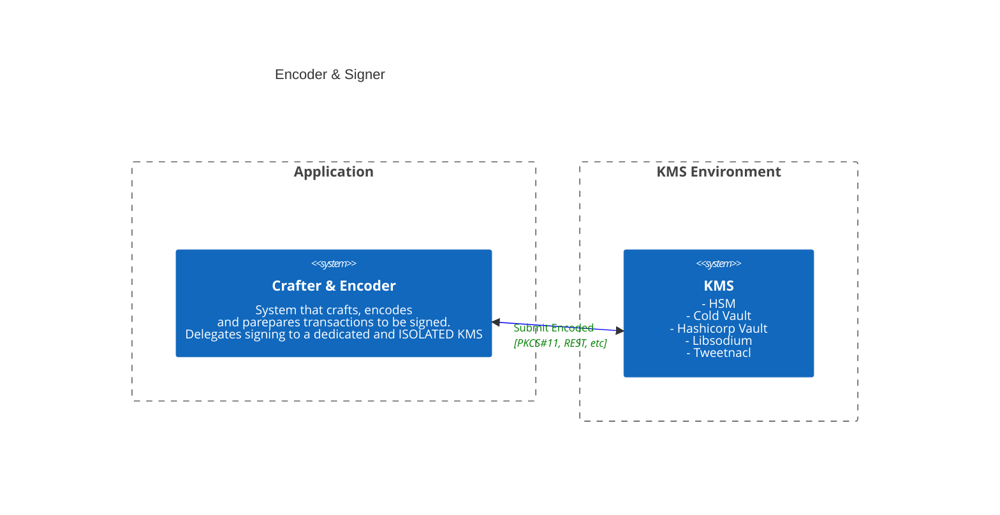

# Algo Models

## Motivation

This package is meant for integrators that want to add Algorand's functionality to their applications. 

## Goal

- Interoperability with KMS systems
- Simple encoding / decoding of raw transactions, keys and addresses
- Builder pattern for crafting

### For whom is this package?

- For the **heavy** user's or **advanced** integrators that want or need to work with **interoperability** between systems. Such as, **cold** vault system, **HSM**'s, validation of encoded transaction payloads (i.e verification, attached signatures, API validations). 

- For someone that wants to keep **dependencies** to a **minimum** rather than importing packages that bring everything into their toolchains.

- For anyone that wants to **understand** and **learn** about the format of the encoded transactions, how to validate and sign them.

## Functionality
- Definition and crafting of models for Algorand's transactions that are compliant directly with the protocol and with `algod`'s submission API.
    - `algosdk`, `goal` and [Developer Portal](https://developer.algorand.org/docs/get-details/transactions) work with models that are specific to eachother and other toolkits, but not directly with the protocol.
- Schemas for validation of encoded payloads against the protocol's expected transaction format and types.
    - Some differences from the SDK/ GOAL include:
        - `snd` / `rcv` are not a string representing the address but the corresponding public key / (x,y) point in compressed form (only 32 bytes required). 
        - The encoded object doesn't include the `txn` field, only it's parameters. 
        - `gh` is not a base64 string but the decoded bytes of the genesis hash. 32 bytes in size. 

## Install
```shell
$ yarn add @algorandfoundation/algo-models
```

or

```shell
$ git clone git@github.com:algorandfoundation/algo-models 
```

## Tests

```shell
$ yarn install
$ yarn build
$ yarn test:cov
```

## Craft Transaction

```ts
let { AlgorandTransactionCrafter, PayTransaction } = require('@algorandfoundation/algo-models')

// sample vars
const genId = "testnet-v1.0"
const genesisHash = "SGO1GKSzyE7IEPItTxCByw9x8FmnrCDexi9/cOUJOiI="
const amount = 1000000
const from = "TIQ4WPFJQYSP2SKLSCDWTK2IIQQ6FOS6BHYIYDGRUZSSROJC5P3HBCZ67Y"
const to = "66LKPOMVQJL2YVMTAVULQVZMZZCD5M2YVWA7KRHEOHYOJU5KLH2PB7HRRY"

const algoCrafter = new AlgorandTransactionCrafter(genId, genesisHash)

const tx: PayTransaction = algoCrafter
    .pay(amount, from, to)
    .addFirstValidRound(1000)
    .addLastValidRound(1500)
    .get()

// The encoding algorithm is a fork of the actual msgpack (https://github.com/EvanJRichard/msgpack-javascript)
// After msgpack encoding a TX TAG is added as a prefix to the result. 
const encoded: Uint8Array = tx.encode() // encoded msg ready - to be signed with EdDSA

```

### Crafter + Signer

#### Suggested integration with external KMS's, HSM's and other Cold Vault Systems



## Validate Encoded Payloads against protocol schema

Any system that receives or builds encoded payloads should validate them against the protocol's valid transaction schemas. These can be found in the [schemas](./schemas) folder.

```ts
import fs from 'fs'
import Ajv, {JSONSchemaType} from "ajv"

// ...
const encoded: Uint8Array = tx.encode()

const ajv = new Ajv()

// get schemas/pay.transaction.json
const paySchema: JSONSchemaType<PayTransaction> = JSON.parse(fs.readFileSync(path.resolve(__dirname, "./schemas/pay.transaction.json"), "utf8"))

const validate = ajv.compile(paySchema)
expect(validate(tx)).toBe(true)

```

## Attaching signatures

```ts
const ready: Uint8Array = algoCrafter.addSignature(encoded, signature) // ready to submit

// It can be decoded with: new AlgorandTransactionDecoder().decodeSignedTransaction(ready)

// optional: write to file with fs
import fs from 'fs'
fs.writeFileSync("/tmp/path/to/ready-tx-binary", ready)
```
## Push transaction

```ts
curl --request POST -i -H "X-Algo-API-Token: ``" -H "Content-Type: application/x-binary" --data-binary "@/tmp/path/to/ready-tx-binary" https://testnet-api.algonode.cloud:443/v2/transactions

```


## Schemas for models

Available in [schemas](./lib/schemas) folder
